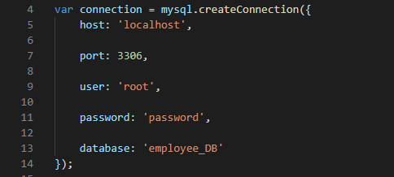
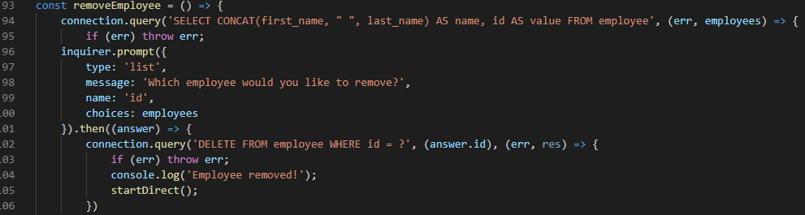

# Employee Tracker

  

## Description

In this project I was prompted with the ask of creating an employee directory from scratch! In order to do so, I needed to create an initial database with 3 different tables (employees, role, department). After creating the database I needed to set up my interactions with the database through Node.js. I created the employeeReadData.js where I have all of my user interactions through inquirer and connection.query. The user can now add, delete and view all tables in the console. This application is very simple to run and easily manageable. Please have a look at the below video to see an example of how it's used:

[Video]()

## Table of Contents

* [Technology-Used](#technology-used)

* [Contribute](#contribute)

* [Tests](#tests)

* [Making](#making)

* [Questions](#questions)

## Technology-Used

- GitHub - repository storage for the project in order to amke changes, deploy them and push to a main branch. 

- GitBash - used for written commands and communicating with the repository stored on GitHub.

- Javascript - a programming language that makes your webpage user interactive.

- Node.js - an efficient platform that runs Javascript outside of the web browser.
    - Require
    - Inquirer
    - Connection.query

- mySQL - a database constructor to create management systems of a bulk of data.
    - Create Table
    - Insert Into
    - Use
    - Create Database

## Contribute 
    
In order to contribute, you will need to know the following languges:
    
  - Node, Javascript.

## Tests

To run tests, please use the following command:

  - node employeeReadData.js

## Making

How was it made? Take a look here!

This is creating the connection between MySQL database and my employeeReadData.js File.

This is my function to remove an employee from the database. After selecting Remove Employee from the inital prompt, the user will be prompted with selecting which employee to remove. The application selects all employees from the database and displays them as options. Once the user selects a name, the name is then deleted.

## Questions

Please click the link to see my Full GitHub profile:

[GitHub](https://github.com/dnovelli1)

If you have any questions, please see the following links to best get in contact with me:

[Email Me](jakenovelli11@gmail.com)

## License

This project is currently licensed under the MIT [License](https://choosealicense.com/licenses/mit/)
  
